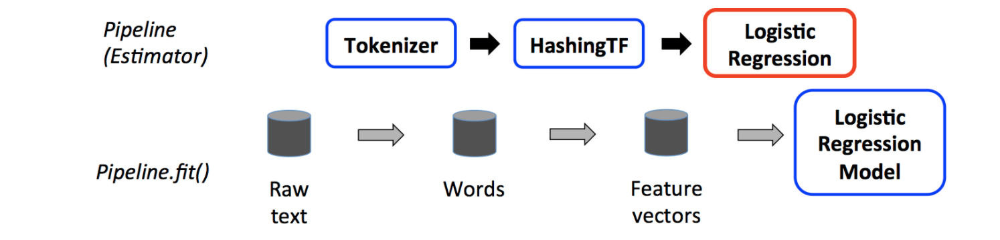
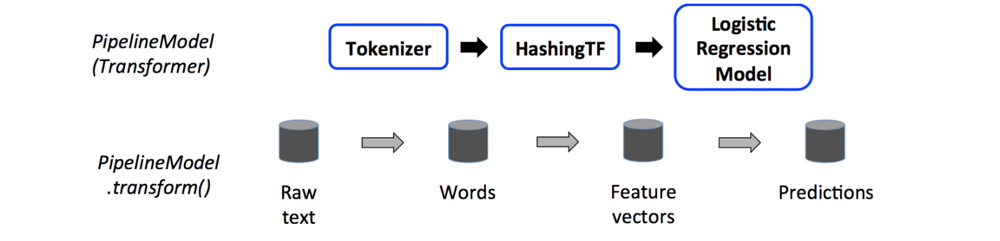

# 基于大数据的机器学习

机器学习是一门人工智能科学，该领域的主要研究对象是人工智能。机器学习利用数据或以往的经验，以此优化计算机程序的性能标准  
机器学习强调三个关键词：算法、经验、性能


- 传统的机器学习算法，由于技术和单机存储的限制，只能在少量数据上使用，依赖数据抽样
- 大数据技术的出现，可以支持在全量数据上进行机器学习
- 机器学习算法涉及大量迭代计算
- 基于磁盘的MapReduce不适合进行大量迭代计算
- 基于内存的Spark比较适合进行大量迭代计算

# 机器学习库MLlib概述

- Spark提供了一个基于海量数据的机器学习库，它提供了常用机器学习算法的分布式实现
- 开发者只需要有Spark基础并且了解机器学习算法的原理，以及方法相关参数的含义，就可以轻松的调用相应的API来实现基于海量数据的机器学习过程
- 需要注意的是，MLlib中只包含能够在集群上运行良好的并行算法，这一点很重要
- 一些较新的研究得出的算法因为使用于集群，也被包含在MLlib中，例如分布式随机森林算法、最小交替二乘法。
- 如果是小规模数据集上训练各机器学习模型，可以是用单节点的机器学习算法库（Weka）
- MLlib由一些通用的机器学习算法和工具组成，包括分类、回归、聚类、协同过滤、降维等,同时还包括底层的优化原语和高层的流水线（Pipeline）API，具体如下：
    - 算法工具：常用的学习算法，如分类、回归、聚类和协同过滤
    - 特征化工具：特征提取、转化、降维和选择工具
    - 流水线(Pipeline)：用于构建、评估和调整机器学习工作流的工具
    - 持久性：保存和加载算法、模型和管道
    - 实用工具：线性代数、统计、数据处理等工具
    
    
    
MLlib目前支持4中常见的机器学习问题：分类、回归、聚类和协同过滤
    
    
  ||离散数据|连续数据|  
  |--|--|--| 
  |监督学习|Classification、LogisticRegression(with Elastic-Net)、SVM、DecisionTree、RandomForest、GBT、NaiveBayes、MultilayerPerceptron、OneVsRest| Regression、LogisticRegression(with Elastic-Net)、DecsionTree、RandomFores、GBT、AFTSurvivalRegression、IsotonicRegression|
  |无监督学习|Clustering、KMeans、GuassianMixture、LDA、PowerIterationClustering、BisectingKMeans| Dimensionality Reduction、 matrix factorization、PCA、SVD、ALS、WLS|

# 基本数据类型
spark.ml包提供了一系列基本数据类型以及支持底层的机器学习算法，主要的数据类型包括本地向量、标注点、本地矩阵等。本地向量与本地矩阵作为公共接口提供简单数据模型，底层的线性代数操作由Breeze库和jblas库提供；标注点类型表示监督学习的训练样本

### 本地向量
本地向量分为稠密向量(DenseVector)和稀疏向量(SparseVector)两种。稠密向量使用双精度浮点型数组来表示每一纬的元素，稀疏向量则是基于一个整型索引数组和一个双精度浮点型的值数组。例如，向量(1.0, 0.0, 3.0)的稠密向量表示形式是[1.0, 0.0, 3.0]，而稀疏向量形式则是(3, [0,2], [1.0, 3.0])，其中，3是向量的长度，[0, 2]是向量中非0维度的索引值，表示位置为0、2的两个元素为非零值，而[1.0, 3.0]则是按索引排列的数组元素值

所有本地向量都以`org.apache.spark.ml.linalg.Vector`为基类，`DenseVector`和`SparseVector`分别是它的两个继承类，故推荐使用Vecotrs工具类下定义的工厂方法来创建本地向量。需要注意的是，Scala会默认引入`scala.collection.immutable.Vector`，如果要使用`spark.ml`包提供的向量类型，要导入`org.apache.spark.ml.linalg.Vector`这个。例如：
```scala
scala> import org.apache.spark.ml.linalg.{Vector, Vectors}
import org.apache.spark.ml.linalg.{Vector, Vectors}

//创建一个稠密本地向量
scala> val dv: Vector = Vectors.dense(2.0, 0.0, 8.0)
dv: org.apache.spark.ml.linalg.Vector = [2.0,0.0,8.0]

//创建一个稀疏本地向量
//方法第二个参数数组指定了非零元素的索引，而第三个参数数组则给定了非零元素值
scala> val sv1: Vector = Vectors.sparse(3, Array(0, 2), Array(2.0, 8.0))
sv1: org.apache.spark.ml.linalg.Vector = (3,[0,2],[2.0,8.0])

//另一种创建稀疏本地向量
//方法的第二个参数是一个序列，其中每个元素都是一个非零值的元组:(index, elem)
scala> val sv2: Vector = Vectors.sparse(3, Seq((0, 2.0), (2, 8.0)))
sv2: org.apache.spark.ml.linalg.Vector = (3,[0,2],[2.0,8.0])
```

### 标注点
标注点(Labeled Point)是一种带有标签(Label/Response)的本地向量，通常用在监督学习算法中，它可以是稠密或者稀疏的。由于标签是用双精度浮点型来存储的，因此，标注点类型在回归(Regression)和分类(Classification)问题上均可使用。例如，对于二分类问题，则正样本的标签为1，负样本的标签为0；对于多分类别的分类问题来说，标签则应是一个以0开始的索引序列:0,1,2,...

标注点的实现类是`org.apache.spark.feature.LabeledPoint`，位于`org.apache.spark.ml.feature`包下，标注点的创建方法如下：
```scala
scala> import org.apache.spark.ml.linalg.Vectors
import org.apache.spark.ml.linalg.Vectors

scala> import org.apache.spark.ml.feature.LabeledPoint
import org.apache.spark.ml.feature.LabeledPoint

//下面创建一个标签为1.0（分类中可视为正样本）的稠密向量标注点
scala> val pos = LabeledPoint(1.0, Vectors.dense(2.0, 0.0, 8.0))
pos: org.apache.spark.ml.feature.LabeledPoint = (1.0,[2.0,0.0,8.0])

//创建一个标签为0.0（分类中可视为负样本）的稀疏向量标注点
scala> val neg = LabeledPoint(0.0, Vectors.sparse(3, Array(0, 2), Array(2.0, 8.0)))
neg: org.apache.spark.ml.feature.LabeledPoint = (0.0,(3,[0,2],[2.0,8.0]))
```

在实际的机器学习问题中，稀疏向量数据是非常常见的，MLlib提取了读取LIBSVM格式数据的支持，该格式被广泛用于LIBSVM、LIBLINEAR等机器学习库。该格式下，每一个带有标签的样本点由以下格式表示：  
`label index1:value1    index2:value2   index3:value3 ···`  
其中，label是该样本点的标签值，一系列`index:value`则代表了该样本向量中所有非零元素的索引和元素值。需要特别注意的是，index是以1开始并递增的。

下面读取一个LIBSVM格式文件生成向量:
```scala
scala> val examples = spark.read.format("libsvm").load("file:///opt/spark/data/mllib/sample_libsvm_data.txt")
examples: org.apache.spark.sql.DataFrame = [label: double, features: vector]
```

这里，spark是spark-shell自动建立的`SparkSession`，它的read属性是`org.apache.spark.sql`包下名为DataFrameReader类的对象，该对象提供了读取LIBSVM格式的方法，使用非常方便。下面继续查看加载进来的标注点的值:
```scala
scala> examples.collect().head
res0: org.apache.spark.sql.Row = [0.0,(692,[127,128,129,130,131,154,155,156,157,158,159,181,182,183,184,185,186,187,188,189,207,208,209,210,211,212,213,214,215,216,217,235,236,237,238,239,240,241,242,243,244,245,262,263,264,265,266,267,268,269,270,271,272,273,289,290,291,292,293,294,295,296,297,300,301,302,316,317,318,319,320,321,328,329,330,343,344,345,346,347,348,349,356,357,358,371,372,373,374,384,385,386,399,400,401,412,413,414,426,427,428,429,440,441,442,454,455,456,457,466,467,468,469,470,482,483,484,493,494,495,496,497,510,511,512,520,521,522,523,538,539,540,547,548,549,550,566,567,568,569,570,571,572,573,574,575,576,577,578,594,595,596,597,598,599,600,601,602,603,604,622,623,624,625,626,627,628,629,630,651,652,653,654,655,656,657],[51.0,159.0,253.0,159.0,50.0,48.0,238.0,252.0,25...
```
这里，`examples.collect()`把RDD转换为了向量，并取第一个元素的值。每个标注点共有692个维，其中，第127列对应的值是51.0，第128列对应的值是159.0，以此类推

### 本地矩阵
本地矩阵具有整型的行、列索引值和双精度浮点型的元素值，他存储在单机上。MLlib支持稠密矩阵`DenseMatrix`和稀疏矩阵`SparseMatrix`两种本地矩阵。稠密矩阵将所有元素的值存储在一个列优先(Column-major)的双精度型数组中，而稀疏矩阵则将非零元素以列优先的CSC(Compressed Sparse Column)模式进行存储。

本地矩阵的基类是`org.apache.spark.ml.linalg.Matrix`,`DenseMatrix`和`SparseMatrix`均是他的继承类。和本地向量类似，`spark.ml`包也为本地矩阵提供了相应的工具类Matrices，调用工厂方法即可创建实例。下面创建一个稠密矩阵：  
```scala
scala> import org.apache.spark.ml.linalg.{Matrix, Matrices}
import org.apache.spark.ml.linalg.{Matrix, Matrices}

//下面创建一个3行2列的稠密矩阵[ [1.0, 2.0], [3.0, 4.0], [5.0, 6.0]]
//这里的数组参数是列优先，即按照的方式从数组中提取元素
scala> val dm: Matrix = Matrices.dense(3, 2, Array(1.0, 3.0, 5.0, 2.0, 4.0, 6.0))
dm: org.apache.spark.ml.linalg.Matrix =
1.0  2.0
3.0  4.0
5.0  6.0
```

下面继续创建一个稀疏矩阵
```scala
//创建一个3行2列的稀疏矩阵[ [9.0, 0.0], [0.0, 8.0], [0.0, 6.0]]
//第一组数组参数表示列指针，即每一列元素的开始索引值
//第二个数组参数表示行索引，即对应的元素是属于哪一行
//第三个数组即是按列优先排列的所有非零元素，通过列指针和行索引即可判断每个元素所在的位置
scala> val sm: Matrix = Matrices.sparse(3, 2, Array(0, 1, 3), Array(0, 2, 1), Array(9, 6, 8))
sm: org.apache.spark.ml.linalg.Matrix =
3 x 2 CSCMatrix
(0,0) 9.0
(2,1) 6.0
(1,1) 8.0
```

这里创建了一个3行2列的稀疏矩阵[ [9.0, 0.0], [0.0, 8.0], [0.0, 6.0]]。`Matrices.sparse`的参数中，3表示行数，2表示列数。第1个数组参数表示列指针，其长度=列数+1，表示每一列元素的开始索引值。第2个数组参数表示行索引，即对应的元素是属于哪一列，其长度=非零元素的个数。第3个数第2列有2个(=3-1)元素；第二个数组(0, 2, 1)表示共有3个元素，分别在第0、2、1行

# 机器学习流水线
## 机器学习流水线概念
- DataFrame：使用Spark SQL中的DataFrame作为数据集，它可以容纳各种数据类型。较之RDD，DataFrame包含了schema信息，更类似传统数据库的二维表格。
- 它被ML Pipeline用来存储源数据。例如，DataFrame中的列可以是存储的文本、特征向量、真实标签和预测的标签等

- Transformer：转换器，是一种可以将一个DataFrame转换为另一个DataFrame的算法。比如一个模型就是一个Transformer。它可以把一个不包含预测标签等测试数据集DataFrame打上标签，转换成另一个包含预测标签的DataFrame
- Estimator：估计器或评估器，它是学习算法或在训练数据上的训练方法的概念抽象。在Pipeline里通常是被用来操作DataFrame数据并生成一个Transformer。从技术上讲，Estimator实现了一个方法fit()，它接受一个DataFrame并产生一个转换器。比如一个随机森林算法就是一个Estimator，它可以调用fit()，通过训练特征数据而得到一个随机深林算法
- Parameter：Parameter被用来设置Transformer或者Estimator的参数。现在，所有转换器和评估器可共享用于指定参数的公共API。ParamMap是一组（参数，值）对
- PipeLine：流水线或者管道。流水线将多个工作流阶段（转换器和评估器）连接在一起，形成机器学习的工作流，并获得结果输出。


## 流水线工作流程
要构建一个Pipeline流水线，首先需要定义Pipeline中的各个流水线阶段PipelineStage(包括转换器和评估器），比如指标提取和转换模型训练等。有了这些处理特定问题的转换器和评估器，就可以按照具体的处理逻辑有序地组织PipelineStages并创建一个Pipeline

```scala
val pipeline = new Pipeline().setStages(Array(stage1, stage2, stage3, ...))
```

在一个流水线中，上一个PipelineStage的输出，恰好是下一个PipelineStage的输入。流水线建好以后，就可以把训练数据集作为输入参数，调用流水线实例的fit()方法，以流的方式来处理源训练数据。该调用会返回一个PipelineModel类的实例，进而被用来预测测试数据的标签。更具体地说，流水线的各个阶段按顺序运行，输入的DataFrame在它通过每个阶段时会被转换，对于转换器阶段，在DataFrame上会调用`transform()`方法，对于评估器阶段，先调用fit()方法来生成一个转换器，然后在DataFrame上调用该转换器的transform()方法。

例如，如下图所示，一个流水线具有3个阶段，前两个阶段(Tokenizer和HashingTF)是转换器，第三个阶段(LogisticRegression)是评估器。图中
下面一行表示流经这个流水线的数据，其中，圆柱表示`DataFrame`。在原始DataFrame上调用`Pipeline.fit()`方法执行流水线，每个阶段运行流程如下：

(1)在Tokenizer阶段，调用`transform()`方法将原始文本文档拆分为单词，并向DataFrame添加一个带有单词的新列；  
(2)在HashingTF阶段，调用其`transform()`方法将DataFrame中的单词列转换为特征向量，并将这些向量作为一个新列添加到DataFrame中  
(3)在LogisticsRegression阶段，由于它是一个评估器，因此会调用`LogisticRegresion.fit()`产生一个转换器`LogisticRegresionModel`；如果工作流有更多的阶段，则在将DataFrame传递到下一阶段之前，会调用LogisticsRegressionModel的transform()方法。



流水线本身就是一个评估器，因此，在流水线的fit()方法运行之后，会产生一个流水线模型(PipelineModel)，这是一个转换器，可在测试数据的时候使用。如下图所示，PipelineModel具有与原流水线相同的阶段数，但是，原流水线中的所有评估器。调用PipelineModel的transform()方法时，测试数据按顺序通过流水线的各个阶段，每个阶段的transform()方法更新数据集（DataFrame），并将其传递到下一个阶段。通过这种方式，流水线和PipelineModel确保了训练和测试数据通过相同的特征处理步骤。这里给出的示例都是用于线性流水线的，即流水线中每个阶段使用由前一阶段产生的数据，但是，也可以构建一个有向无环图（DAG）形式的流水线，以拓扑顺序指定每个阶段的输入和输出列名称。流水线的阶段必须时唯一的实例，相同的实例不应该两次插入流水线。但是，具有相同类型的两个阶段实例，可以放在同一个流水线中，流水线将使用不同的ID创建不同的实例。此外，DataFrame会对各个阶段的数据类型进行描述，流水线和流水线模型(PipelineModel)会在实际运行流水线之前，做类型的运行时检查，但不能使用编译时的类型检查。




MLlib评估器和转换器，使用统一的API指定参数。其中，Param是一个自描述包含文档的命名参数，而ParamMap是一组(参数,值)对。将参数传递给算法主要有两种方法：
- 设置实例的参数。例如，lr是一个LogisticRegression实例，用`lr.setMaxIter(10)`进行参数设置后，可以使`lr.fit()`最多迭代10次
- 传递ParamMap给fit()或transform()函数。ParamMap中的任何参数，将覆盖先前通过set方法指定的参数

需要注意的是参数同时属于评估器和转换器的特定实例。如果同一个流水线中的两个算法实例（比如LogisticRegression实例lr1和lr2），都需要设置`maxItera`参数，则可以建立一个ParamMap，即`ParamMap(lr1.maxIter -> 10, lr2.maxIter -> 20)`，然后传递给这个流水线


# 特征提取、转换和选择
机器学习过程中，输入的数据格式多种多样，为了满足相应机器学习算法的格式，一般都需要对数据进行预处理。特征处理相关的算法大体分为以下3类。

(1)特征提取：从原始数据中抽取特征；  
(2)特征转换：缩放、转换或修改特征；   
(3)特征选择：从较大特征集中选取特征子集  

## 特征提取
特征提取(Feature Extraction)是指利用已有的特征计算出一个抽象程度更高的特征集，也指计算得到某个特征的算法。

**1.特征提取操作**  
spark.ml包提供的提取操作包括以下几种：  
(1)TF-IDF。词频-逆向文件频率(Term Frequency_Inverse Document Frequency, TF-IDF)是文本挖掘领域常用的特征提取方法。给定一个语料库，TF-IDF通过词汇在语料库中出现次数和在文档中出现次数，来衡量每个词汇对文档的重要程度，进而构建基于语料库的文档的向量化表达。  
(2)Word2Vec。Word2Vec是由Google提出的一种词前乳(Word Embedding)向量化模型。有CBOW和Skip-gram两种模型，spark.ml使用的是后者。
(3)CountVectorizer。CountVectorizer可以看成是TF-IDF的退化版本，它仅通过度量每个词汇在文档中出现的次数（词频），来为每一个文档构建出向量化表达，可以通过设置超参数来限制向量维度，过滤掉出现较少的词汇

**2.特征提取的例子**  
“词频-逆向文件频率”(TF-IDF)是一种在文本挖掘中广泛使用的特征向量化方法，它可以体现一个文档中词语在语料库中的重要程度。

词语由t表示，文档由d表示，语料库由D表示。词频TF(t, d)是词语t在文档d中出现的次数。文件频率DF(t, D)是包含词语的文档的个数。TF-IDF就是在数值化文档信息，衡量词语能够提供多少信息以区分文档。其定义如下:
$$
        IDF(t,D) = log \frac {|D| + 1}{DF(t,D)+1} \\
$$

其中，`|D|`是语料库中总的文档数。公式中使用log函数，当词出现在所有文档中时，它的IDF值变为0。`DF(t, D)+1`是为了避免分母为0的情况。TF-IDF度量值表示如下：

$$

        TFIDF(t,d,D) = TF(t,d)·IDF(t,D)
$$

在Spark ML库中，TF-IDF被分成两部分：
- TF(+hashing)
    HashingTF是一个Transformer，在文本处理中，接收词条的集合然后把这些集合转化为固定长度的特征向量。这个算法在哈希的同时会统计各个词条的词频。
        
- IDF
    IDF是一个Estimator，在一个数据集上应用它的fit()方法，产生一个IDFModel。该IDFModel接收特征向量（由HashingTF产生），然后计算每一个词在文档中出现的频次。IDF会减少那些在语料库中出现频率较高的词的权重。


下面是一个实例。
- 导入TF-IDF需要的包  
    ```scala
    scala> import org.apache.spark.ml.feature.{HashingTF, IDF, Tokenizer}
    ```
- 创建一个集合，每一个句子代表一个文件
    ```scala
    scala> val sentenceData = spark.createDataFrame(Seq(
     | (0, "I heard about Spark and I love Spark"),
     | (0, "I wish Java could use case classes"),
     | (1, "Logistic regression model are neat")
     | )).toDF("label", "sentence")
    ```
- 用Tokenizer把每个句子分解成单词
    ```scala
    scala> val tokenizer = new Tokenizer().setInputCol("sentence").setOutputCol("words")
    scala> val wordsData = tokenizer.transform(sentenceData)

    scala> wordsData.show(false)
    +-----+------------------------------------+---------------------------------------------+
    |label|sentence                            |words                                        |
    +-----+------------------------------------+---------------------------------------------+
    |0    |I heard about Spark and I love Spark|[i, heard, about, spark, and, i, love, spark]|
    |0    |I wish Java could use case classes  |[i, wish, java, could, use, case, classes]   |
    |1    |Logistic regression model are neat  |[logistic, regression, model, are, neat]     |
    +-----+------------------------------------+---------------------------------------------+

    ```

- 用HashingTF的transform()方法把每个“词袋”哈希成特征向量。这里设置哈希表的桶数为2000
    ```scala
    scala> val hashingTF = new HashingTF().setInputCol("words").setOutputCol("rawFeatures").setNumFeatures(2000)

    scala> val featurizeData = hashingTF.transform(wordsData)
    scala> featurizeData.select("words", "rawFeatures").show(false)
    +---------------------------------------------+---------------------------------------------------------------------+
    |words                                        |rawFeatures                                                          |
    +---------------------------------------------+---------------------------------------------------------------------+
    |[i, heard, about, spark, and, i, love, spark]|(2000,[240,333,1105,1329,1357,1777],[1.0,1.0,2.0,2.0,1.0,1.0])       |
    |[i, wish, java, could, use, case, classes]   |(2000,[213,342,489,495,1329,1809,1967],[1.0,1.0,1.0,1.0,1.0,1.0,1.0])|
    |[logistic, regression, model, are, neat]     |(2000,[286,695,1138,1604,1857],[1.0,1.0,1.0,1.0,1.0])                |
    +---------------------------------------------+---------------------------------------------------------------------+    
    ```

- 调用IDF方法来重新构造特征向量的规模，生成的变量idf是一个评估器，在特征向量上应用它的fit()方法，会产生一个IDFModel(名称为idModel)
    ```scala
    scala> val idf = new IDF().setInputCol("rawFeatures").setOutputCol("features")

    scala> val idfModel = idf.fit(featurizeData)
    ```

- 调用IDFModel的transform()方法，可以得到每一个单词对应的TF-IDF度量值
    ```scala
    scala> val rescaledData = idfModel.transform(featurizeData)

    scala> rescaledData.select("features", "label").show(false)
    +-------------------------------------------------------------------------------------------------------------------------------------------------------------------------------+-----+
    |features                                                                                                                                                                       |label|
    +-------------------------------------------------------------------------------------------------------------------------------------------------------------------------------+-----+
    |(2000,[240,333,1105,1329,1357,1777],[0.6931471805599453,0.6931471805599453,1.3862943611198906,0.5753641449035617,0.6931471805599453,0.6931471805599453])                       |0    |
    |(2000,[213,342,489,495,1329,1809,1967],[0.6931471805599453,0.6931471805599453,0.6931471805599453,0.6931471805599453,0.28768207245178085,0.6931471805599453,0.6931471805599453])|0    |
    |(2000,[286,695,1138,1604,1857],[0.6931471805599453,0.6931471805599453,0.6931471805599453,0.6931471805599453,0.6931471805599453])                                               |1    |
    +-------------------------------------------------------------------------------------------------------------------------------------------------------------------------------+-----+

    ```

在sbt打包时，build.sbt文件的内容应该改为
```sbt
name := "Simple Project"
version := "1.0"
scalaVersion := "2.11.8"
libraryDependencies += "org.apache.spark" % "spark-mllib_2.11" % "2.0.0"
``` 

### 特征转换
机器学习处理过程经常需要对数据或者特征进行转换，通过转换操作可以消除原始特征之间的相关或者减少冗余，得到新的特征。

**1.特征转换操作**  
(1)Tokenizer  
Tokenizer可以将给定的文本数据进行分割（根据空格和标点），将文本中的句子变成独立的单词序列，并转为小写表达。  

(2)StopWordsRemover  
StopWordsRemover可以将文本中的停止词去除，spark.ml中已经自带来常见的西方语言的停止词表，可以直接使用。  

(3)NGram  
NGram将经过分词的一系列词汇序列，转变为自然语言处理中常见的"n-gram"模型，即通过该词汇序列可构造出的、所有由连续相邻的n个词构成的序列。需要注意的是，当词汇序列小于n时，NGram不产生任何输出  

(4)Binarizer  
Binarizer可以根据某一给定的阈值，将数值型特征转化为0-1的二元特征。  

(5)PCA  
PCA(主成分分析)是一种通过数据旋转变换进行降维的统计学方法，其本质是在线性空间中进行一个基变换，使得变换后的数据投影在一组新的“坐标轴”上的方差最大化，并使得变换后的数据在一个较低维度的子空间中，尽可能地表示原有数据的性质。

(6)PolynomialExpansion  
PolynomialExpansion对给定的特征进行多项式展开操作，对于给定的“度”，它可以将原始的数值特征，扩展到相应次数的多项式空间中去。  

(7)Discreate Cosine Transform(DCT)  
离散余弦变换(DCT)是快速傅立叶变化(FFT)的一种衍生形式，是信号处理常用的变 换方法，它将给定的N个实数值序列从时域上转变到频域上。  

(8)StringIndexer  
StringIndexer可以把一列类别型的特征进行编码，使其数值化，索引的范围从0开始，该过程可以使得相应的特征索引化，使得某些无法接受类别型特征的算法可以被使用，并提高决策树等机器学习算法的效率。  

(9)IndexToString  
与IndexToString相对应，IndexToString的作用是把已经索引化的一列标签重新映射回原有的字符类型。主要使用场景一般是和StringIndexer配合，先用StringIndexer将标签转化成标签索引，进行模型训练，然后，在预测标签的时候，再把标签索引转化成原有的字符标签  

(10)OneHotEncoder  
OneHotEncoder会把一列类别型特征（或称名词性特征，Nominal/Categorical Features），映射一系列的二元连续特征，原有的类别型特征有几种可能的取值，这一特征就会被映射成几个二元连续特征，每一个特征代表一种取之，若某个样本表现出该特征，则取1，否则取0  

(11)VectorIndexer  
VectorIndexer将整个特征向量中的类别型特征处理成索引形式。当所有特征都已经被组织在一个向量中，又想对其中某些单个类别型分量进行索引化处理时，VectorIndexer根据用户设定的阈值，自动确定哪些是类别型，并进行相应的转换

(12)Interaction  
Interaction可以接受多个向量或浮点数类型的列，并基于这些向量生成一个包含所有组合的乘积的新向量。新向量的维度是参与变换的所有向量的维度之积。  

(13)Normalizer  
Normalizer可以对给定的数据进行“规范化”操作，即根据设定的范数，将每一个样本的特征向量的模进行单位化。规范化可以消除输入数据的量纲影响，已经广泛应用于文本挖掘等领域  

(14)StanderScaler   
StanderScaler将给定的数据进行“标准化”操作，即将每一个维度的特征都进行缩放，以将其转变为具有单位方差以及/或0均值的序列

(15)MinMaxScaler  
MinMaxScaler根据给定的最大值和最小值，将数据集中的各个特征缩放到该最大值和最小值范围之内，当没有具体指定最大值/最小值时，默认在[0, 1]

(16)MaxAbsScaler    
MaxAbsScaler用每一维特征的最大绝对值对给定的数据集进行缩放，实际上是将每一维度的特征都缩放在[-1, 1]区间中

(17)Bucketizer    
Bucketizer对连续性特征进行离散化操作，使其转变为离散特征。用户需要手动对特征进行离散化的区间的分割位置，该区间必须是严格递增的

(18)ElementwiseProduct   
ElementwiseProduct适合给整个特征向量进行“加权”操作，给定一个权重向量指定出每一个特征的权值，它将此向量对整个数据集进行相应的加权操作。其过程相当于代数学上的哈达玛乘积(Hadamard product)

(19)SQLTransformer  
SQLTransformer通过SQL语句对原始数据集进行处理，给定输入数据集和相应的SQL语句，它将根据SQL语句定义的选择条件对数据集进行变换。

(20)VectorAssembler  
VectorAssembler可以将输入数据集的某些指定的列组织成单个向量。特别适用于需要针对耽搁特征进行处理的场景，当处理结束后，将所有特征组织到一起，再送入那些向量输入的机器学习算法，如Logistic回归或决策树

(21)QuantileDiscretizer  
QuantileDiscretizer可以看成是Bucketizer的扩展版，他将连续型特征转换为离散型特征。不同的是，它无需用户给出离散化分割的区间位置，只需要给出期望的区间数，即会自动调用近似算法计算出相应的分割位置。

**2.特征转换的例子**

(1)StringIndexer  
```scala
scala> import org.apache.spark.ml.feature.StringIndexer
scala> val df1 = spark.createDataFrame(
     | Seq((0, "a"), (1, "b"), (2, "c"), (3, "a"), (4, "a"), (5, "c"))
     | ).toDF("id", "category")
scala> val indexer = new StringIndexer().setInputCol("category").setOutputCol("categoryIndex")
scala> val indexer1 = indexer.fit(df1).transform(df1)
scala> indexer1.show()
+---+--------+-------------+
| id|category|categoryIndex|
+---+--------+-------------+
|  0|       a|          0.0|
|  1|       b|          2.0|
|  2|       c|          1.0|
|  3|       a|          0.0|
|  4|       a|          0.0|
|  5|       c|          1.0|
+---+--------+-------------+
```

(2)IndexToString  
```scala
scala> import org.apache.spark.ml.feature.IndexToString
scala> val tostring = new IndexToString().
     | setInputCol("categoryIndex").
     | setOutputCol("originalCategory")
scala> val indexstring = tostring.transform(indexed1)
scala> indexstring.select("id", "originalCategory").show()
+---+----------------+
| id|originalCategory|
+---+----------------+
|  0|               a|
|  1|               b|
|  2|               c|
|  3|               a|
|  4|               a|
|  5|               c|
+---+----------------+
```

(3)VectorIndexer  
```scala
scala> import org.apache.spark.ml.feature.VectorIndexer
scala> import org.apache.spark.ml.linalg.{Vector, Vectors}
scala> val data = Seq(
     | Vectors.dense(-1.0, 1.0, 1.0),
     | Vectors.dense(-1.0, 3.0, 1.0),
     | Vectors.dense(0.0, 5.0, 1.0))
scala> val df = spark.createDataFrame(data.map(Tuple1.apply)).toDF("features")
scala> val indexer = new VectorIndexer().
     | setInputCol("features").
     | setOutputCol("indexed").
     | setMaxCategories(2)
scala> val indexerModel = indexer.fit(df)
scala> val categoricalFeatures: Set[Int] = indexerModel.categoryMaps.keys.toSet
scala> println(s"Chose ${categoricalFeatures.size} categorical features: " + categoricalFeatures.mkString(","))
scala> val indexed = indexerModel.transform(df)
scala> indexed.show()
+--------------+-------------+
|      features|      indexed|
+--------------+-------------+
|[-1.0,1.0,1.0]|[1.0,1.0,0.0]|
|[-1.0,3.0,1.0]|[1.0,3.0,0.0]|
| [0.0,5.0,1.0]|[0.0,5.0,0.0]|
+--------------+-------------+
```


### 特征选择
特征选择(Feature Selection)指的是在特征向量中选择出那些“优秀”的特征，组成新的、更精简的特征向量的过程。

**1.特征选择操作**   
(1)VectorSlicer  
VectorSlicer的作用类似于MATLAB/numpy中的“列切片”，他可以根据给定的索引（证书索引值或列名索引）选择出特征向量中的部分列，并生成新的特征向量  

(2)RFormula  
RFormula提供了一种R语言风格的特征向量列选择功能，用户可以给其传入一个R表达式，他会根据表达式，自动选择相应的特征列形成新的特征向量  

(3)ChiSqSelector  
ChiSqSelector通过卡方选择的方法来进行特征选择，他的输入需要是一个已有标签的数据集，ChiSqSelector会针对每一个特征与标签的关系进行卡方检验，从而选择出那些统计意义上区分度最强的特征。

**2.选择操作的例子**  
卡方选择是统计学上常用的一种监督特征选择方法，他通过对特征和真实标签之间进行卡方检验，来判断该特征和真实标签的关联程度，进而确定是否对其进行选择。

```scala
scala> import org.apache.spark.ml.feature.{ChiSqSelector, ChiSqSelectorModel}
scala> import org.apache.spark.ml.linalg.Vectors
scala> val df = spark.createDataFrame(Seq(
     | (1, Vectors.dense(0.0, 0.0, 18.0, 1.0), 1),
     | (2, Vectors.dense(0.0, 1.0, 12.0, 0.0), 0),
     | (3, Vectors.dense(1.0, 0.0, 15.0, 0.1), 0)
     | )).toDF("id", "features", "label")
scala> df.show()
+---+------------------+-----+
| id|          features|label|
+---+------------------+-----+
|  1|[0.0,0.0,18.0,1.0]|    1|
|  2|[0.0,1.0,12.0,0.0]|    0|
|  3|[1.0,0.0,15.0,0.1]|    0|
+---+------------------+-----+

scala> val selector = new ChiSqSelector().
     | setNumTopFeatures(1).
     | setFeaturesCol("features").
     | setLabelCol("label").
     | setOutputCol("selected-feature")
scala> val selector_model = selector.fit(df)
scala> val result = selector_model.transform(df)
scala> result.show(false)
+---+------------------+-----+----------------+
|id |features          |label|selected-feature|
+---+------------------+-----+----------------+
|1  |[0.0,0.0,18.0,1.0]|1    |[1.0]           |
|2  |[0.0,1.0,12.0,0.0]|0    |[0.0]           |
|3  |[1.0,0.0,15.0,0.1]|0    |[0.1]           |
+---+------------------+-----+----------------+
```

### 局部敏感哈希
局部敏感哈希(Locality Sensitive Hashing)是一种被广泛应用在聚类、近似最近邻(Approximate Nearest Neighbor, ANN)、近似相似连接(Approximate Similarity Join)等操作的哈希，基本思想就是将那些在特征空间中相邻的点尽可能地映射到同一个哈希桶中


## 分类算法  
分类是一种重要的机器学习和数据挖掘技术。分类的目的是根据数据集的特点构造一个分类函数或者分类模型，该模型能把未知类别的样本映射到给定类别中。

构造分类模型的过程一般分为训练和测试两个阶段。在构造模型之前，将数据集随机地分为训练数据集和测试数据集。先使用训练数据集构造分类模型，然后使用测试数据集来评估模型的分类准确率。

分类算法具有多种不同的类型，例如，支持向量机SVM、决策树算法、贝叶斯算法、KNN算法等。

|问题类型|支持的算法|
|--|--|
|二分类|线性支持向量机，Logistic回归，决策树，随机森林，梯度上升树，朴素贝叶斯|
|多类分类|Logistic回归，决策树，随机森林，朴素贝叶斯|
|回归|线性最小二乘法，Lasso，岭回归，决策树，随机森林，梯度上升树，Isotonic Regression|

### 逻辑斯蒂回归分类器
逻辑斯蒂回归(Logistic Regression)是统计学习中经典的分类方法，属于对数线性模型。逻辑斯蒂回归的因变量可以是二分类，也可以是多分类。二项逻辑斯蒂回归模型如下：

$$
    P(Y = 1|x) = \frac{exp(w ·x + b)}{1 + exp(w·x+b) } \\

 $$
 $$   

    P(Y = 0|x) = \frac{1}{1 + exp(w·x+b) }
$$

以iris数据集为例进行分析，

```scala
scala> import org.apache.spark.ml.linalg.{Vector, Vectors}
scala> import org.apache.spark.ml.feature.{IndexToString, StringIndexer, VectorIndexer}
scala> import org.apache.spark.ml.classification.LogisticRegression
scala> import org.apache.spark.ml.{Pipeline, PipelineModel}
scala> import org.apache.spark.sql.Row
scala> import org.apache.spark.ml.classification.LogisticRegressionModel
scala> import org.apache.spark.ml.evaluation.MulticlassClassificationEvaluator


scala> case class Iris(features: org.apache.spark.ml.linalg.Vector, label: String)
scala> val data = spark.sparkContext.
     | textFile("file:///home/spark/iris.data").
     | map(_.split(",")).
     | map(p => Iris(Vectors.dense(p(0).toDouble, p(1).toDouble, p(2).toDouble, p(3).toDouble), p(4).toString())).
     | toDF()
scala> data.show()
+-----------------+-----------+
|         features|      label|
+-----------------+-----------+
|[5.1,3.5,1.4,0.2]|Iris-setosa|
|[4.9,3.0,1.4,0.2]|Iris-setosa|
|[4.7,3.2,1.3,0.2]|Iris-setosa|
|[4.6,3.1,1.5,0.2]|Iris-setosa|
|[5.0,3.6,1.4,0.2]|Iris-setosa|
|[5.4,3.9,1.7,0.4]|Iris-setosa|
|[4.6,3.4,1.4,0.3]|Iris-setosa|
|[5.0,3.4,1.5,0.2]|Iris-setosa|
|[4.4,2.9,1.4,0.2]|Iris-setosa|
|[4.9,3.1,1.5,0.1]|Iris-setosa|
|[5.4,3.7,1.5,0.2]|Iris-setosa|
|[4.8,3.4,1.6,0.2]|Iris-setosa|
|[4.8,3.0,1.4,0.1]|Iris-setosa|
|[4.3,3.0,1.1,0.1]|Iris-setosa|
|[5.8,4.0,1.2,0.2]|Iris-setosa|
|[5.7,4.4,1.5,0.4]|Iris-setosa|
|[5.4,3.9,1.3,0.4]|Iris-setosa|
|[5.1,3.5,1.4,0.3]|Iris-setosa|
|[5.7,3.8,1.7,0.3]|Iris-setosa|
|[5.1,3.8,1.5,0.3]|Iris-setosa|
+-----------------+-----------+
only showing top 20 rows

scala> val labelIndexer = new StringIndexer().
     | setInputCol("label").setOutputCol("indexedLabel").fit(data)
scala> val featureIndexer = new VectorIndexer().
     | setInputCol("features").setOutputCol("indexedFeatures").fit(data)
scala> val lr = new LogisticRegression().
     | setLabelCol("indexedLabel").
     | setFeaturesCol("indexedFeatures").
     | setMaxIter(100).
     | setRegParam(0.3).
     | setElasticNetParam(0.8)


scala> println("LogisticRegression parameters:\n" + lr.explainParams() +"\n")

scala> val labelConverter = new IndexToString().setInputCol("prediction").
     | setOutputCol("predictedLabel").setLabels(labelIndexer.labels)

scala> val lrPipeline = new Pipeline().
     | setStages(Array(labelIndexer, featureIndexer, lr, labelConverter))

scala> val Array(trainingData, testData) = data.randomSplit(Array(0.7, 0.3))
scala> val lrPipelineModel = lrPipeline.fit(trainingData)
scala> val lrPredictions = lrPipelineModel.transform(testData)

scala> lrPredictions.select("preidctedLabel", "label", "features", "probability").collect().
    | foreach{case Row(predictedLabel: String, label: String, features:Vector, prob:Vector)
    | => println(s"($label, $features) --> prob=$prob, predicted Label=$predictedLabel")}

scala> val evalutor = new MulticlassClassificationEvaluator().
    |setLabelCol("indexedLabel").setPredictionCol("prediction)

scala> val lrAcc = evalutor.evaluate(lrPredictions)
lrAcc: Double = 0.743092516314574

scala> val lrModel = lrPipelineModel.
    | stages(2).asInstanceOf[LogisticRegressionModel]
```

