# Spark Streaming

## 流数据概述
本节内容首先介绍静态数据和流数据的区别，以及针对这两种数据的计算模式，即批量计算和实时计算，然后介绍计算的概念、框架和处理流程。

### 静态数据和流数据
数据总体上分为静态数据和流数据

**1.静态数据**  
很多企业为了支持决策分析而构建的数据仓库（如下图）其中存放的大量历史数据就是静态数据，这些数据来自不同的数据源，利用ETL(Extract-Transform-Load)工具加载到数据仓库中，并且不会发生更新，技术人员可以利用数据挖掘和OLAP(On-Line Analytical Processing)分析工具从这些静态数据中找到对企业有价值的信息。

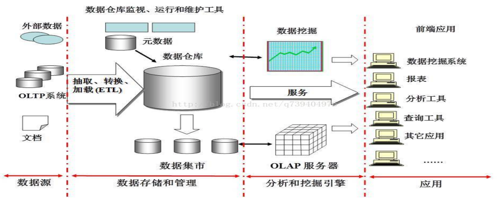

**2.数据流**  
近年来，在Web应用、网络监控、传感检测、电信金融、生产制造等领域，兴起了一种新的数据密集型应用——流数据，即数据以大量、快速、时变的流形式持续到达。以传感检测为例，在大气中放置PM2.5传感器实时监测大气中的PM2.5的浓度，检测数据会源源不断地实时传输回数据中心，检测系统对回传数据进行实时分析，预判空气质量变化趋势，如果空气质量在未来一段时间内会达到影响人体健康的程度，就启动应急响应机制。

从概念上而言，流数据（或数据流）是指在时间分布和数量上无限的一系列动态数据集合体；数据记录是流数据的最小组成单元。流数据具有以下特征。
- 数据快速持续到达，潜在大小也许是无穷无尽的
- 数据来源众多，格式复杂
- 数据量大，但是不十分关注存储，一旦流数据中的某个元素经过处理，要么被丢弃，那么被归档存储
- 注重数据的整体价值，不过分关注个别数据
- 数据顺序颠倒，或者不完整，系统无法控制将要处理的新到达的数据元素的顺序

### 批量计算和实时计算
对静态数据和流数据的处理，对应着两种截然不同的计算模式：**批量计算**和**实时计算**。批量计算以“静态数据”为对象，可以在很充裕的时间内对海量数据进行批量处理，计算得到有价值的信息。Hadoop就是典型的批处理模型，由HDFS和HBase存放大量的静态数据，由MapReduce负责对海量数据执行批量计算。

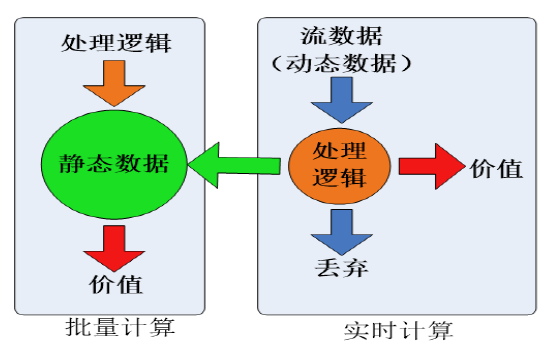

流数据不适合采用批量计算，因为流数据不适合传统的关系模型建模，不能把源源不断的流数据保存到数据库中，流数据被处理后，一部分进入数据库成为静态数据，其他部分则直接被丢弃。传统的关系数据库通常用于满足信息实时交互处理需求。

流数据必须采用实时计算，实时计算最重要的一个需求是能够实时得到计算结果，一般要求响应时间为秒级。当只需要处理少量数据时，实时计算并不是问题；但是，在大数据时代，不仅数据格式复杂、来源众多，而且数据量巨大，这就对实时计算提出了很大的挑战。


### 流计算概念

下图是一个流计算的示意图，流计算平台实时获取来自不同数据源的海量数据，通过实时分析处理，获取有价值的信息。  


流计算秉承一个基本理念，即数据的价值随着时间的流逝而降低。因此，当事件出现时就应该立即进行处理，而不是缓存起来进行批量处理。为了及时处理流数据，就需要一个低延迟、可扩展、高可靠的处理引擎。对于一个流计算系统来说，它应达到如下需求。 
- 高性能。处理大数据的基本要求，如每秒处理几十万数据
- 海量式。支持TB级甚至是PB级的数据规模
- 实时性。必须保证一个较低的延迟时间
- 分布式。支持大数据的基本架构，必须能够平滑扩展
- 易用性。能够快速进行开发和部署
- 可靠性。能够可靠地处理流数据

针对不同的应用场景，相应的流计算系统会有不同的需求，但是，针对海量数据的流计算，无论在数据采集、数据处理中的都应达到秒级别的要求。

### 流计算框架
- 商业级流计算平台
    - IMB InfoSphere Streams。商业级高级计算平台，可以帮助用户额开发应用程序来快速摄取、分析和关联来自数千个实时源的信息
    - IBM StreamBase。IBM开发的另一款商业流计算系统，在金融部门和政府部门使用

- 开源流计算框架
    - Twitter Storm。免费、开源的分布式实时计算系统，可简单、高效、可靠地处理大量的流数据；阿里巴巴的JStorm，是参考Twitter Storm开发的实时流式计算框架，在网络I/O、线程模型、资源调度、可用性及稳定性上做了持续改进。
    - Yahoo! S4(Simple Scalable Streaming System)。开源流计算平台，是通用的、分布式的、可扩展的、分区容错的、可插拔的流式系统

- 公司为支持自身业务开发的流计算框架
    - Facebook Puma。Facebook使用Puma和HBase相结合来处理实时数据
    - DStream。百度开发的实时流数据计算系统
    - 银河流数据处理平台。淘宝开发的通用流数据实时计算系统
    - Super Mario。基于Erlang语言和Zookeeper模块开发的高性能流数据处理框架

### 流计算处理流程
传统的数据处理流程需要先采集数据并存储在关系型数据库等数据管理系统中，之后用户便可以通过查询操作和数据管理操作进行交互，最终得到查询结果。但是，这样一个流程隐含了两个前提。
- 存储的数据是旧的。当对数据做查询的时候，存储的静态数据已经是过去某一时刻的快照，这些数据在查询时可能已经不具备时效性了。
- 需要用户主动发出查询。也就是说用户是主动发出查询来获取结果。

**1.数据实时采集**
数据实时采集阶段通常采集多个数据源的海量数据，需要保证实时性、低延迟性与稳定可靠性。以日志数据为例，由于分布式集群的广泛应用，数据分散存储在不同的机器上，因此需要实时汇总来自不同机器上的日志数据。

目前有许多互联网公司发布的开源分布式日志采集系统均可满足每秒数百MB的数据采集和传输需求，如Facebook的Scribe、Linkdln的Kafka、阿里巴巴的TimeTunnel，以及基于Hadoop的Chukwa和Flume等。

数据采集系统的基本架构一般有3个部分  
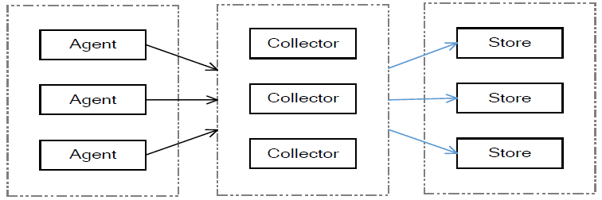

- Agent:主动采集数据
- Collector：接收多个Agent的数据，并实现有序、可靠、高性能
- Store：存储Collector转发过来的数据

但对流计算来说，一般在Store部分不进行数据的存储，而是将采集的数据直接发送给流计算平台进行实时计算。

**2.数据实时计算**  
数据实时计算阶段对采集的数据进行实时的分析和计算。数据实时计算的流程如下，流处理系统接收数据采集系统不断发来的实时数据，实时地进行分析计算，并反馈实时结果。经流处理系统处理后的数据，可视情况进行存储，以便之后再进行分析计算。在时效性要求较高的场景中，处理之后的数据也可以直接丢弃

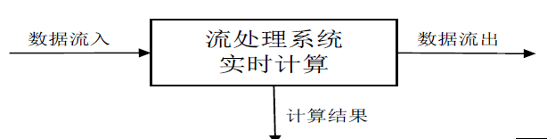

**3.实时查询服务**  
流计算的第三个阶段是实时查询服务，经由流计算框架得出的结果可供用户进行实时查询、展示或储存。传统的数据处理流程，用户需要主动发出查询才能获得想要的结果。而在流处理流程中，实时查询服务可以不断更新结果，并将用户所需的结果实时推送给用户。虽然通过对传统的数据处理系统进行定时查询，也可以实现不断更新结果和结果推送，但通过这样的方式获取的结果，仍然是根据过去某一时刻的数据得到的结果，与实时结果有着本质的区别

由此可见，流处理系统与传统的数据处理系统有如下不同之处：
- 流处理系统处理的是实时的数据，而传统的数据处理系统处理的是预先存储好的静态数据。
- 用户通过流处理系统获取的是实时结果，而通过传统的数据处理获取的是过去某一时刻的结果。并且，流处理系统无需用户主动发出查询，实时查询服务可以主动将实时结果推送给用户。


## Spark Streaming
Spark Streaming是构建在Spark上的实时计算框架，它扩展了Spark处理大规模流式数据的能力。Spark Streaming可结合批处理和交互式查询，因此，可以适用于一些需要对历史数据和实时数据进行结合分析的应用场景

### Spark Streaming设计
Spark Streaming是Spark的核心组件之一，为Spark提供了可拓展、高吞吐、容错的流计算能力。如下图，Spark Streaming可整合多种输入数据源，如Kafka、Flume、HDFS，甚至是普通的TCP套接字。经处理后的数据可存储至文件系统、数据库，或显示在仪表盘里。  
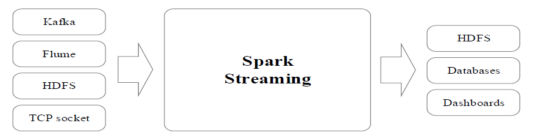

Spark Streaming的基本原理是将实时输入数据流以时间片（通常在0.5-2秒之间）为单位进行拆分，然后采用Spark引擎类似批处理的方式处理每个时间片数据，执行流程如下图。  
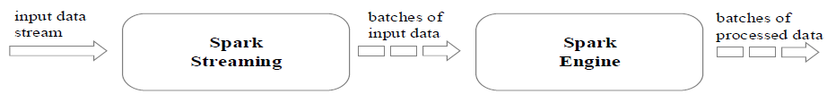

Spark Streaming最主要的抽象是离散化数据流(Discretized Streaming, DStream)，表示为连续不断的数据流。在内部实现上，Spark Streaming的输入数据按照时间片（如1秒）分成一段一段，每一段数据转换为Spark中的RDD，并且对DStream的操作都最终被变为对相应的RDD的操作。实现如下图所示。  
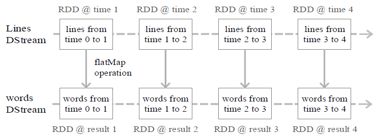

### Spark Streaming和Storm的对比
Spark Streaming和Storm最大的区别在于，Spark Streaming无法实现毫秒级的流计算，而Storm可以实现毫秒级响应。  
Spark Streaming无法实现毫秒级的流计算，是因为其将流数据分解为一系列批处理作业，在这个过程中，会产生多个Spark作业，且每一段数据的处理都会经过Spark DAG图分解、任务调度等过程，需要一定的开销，因此，无法实现毫秒级响应。Spark Streaming采用的小批量处理的方式，使得它可以同时兼得批量和实时数据处理的逻辑和算法，因此，方便了一些需要历史数据和实时数据联合分析的特定应用场合

### 从“Hadoop+Storm”架构转向Spark架构
为了能够同时进行批处理与流处理，企业应用中通常会采用“Hadoop+Storm”的架构（也称为Lambda架构）。下图给出了采用Hadoop+Storm部署方式的一个案例，在这种部署架构中，Hadoop和Storm框架部署在资源管理器YARN（或Mesos）之上，接受统一的资源管理和调度，并共享底层的数据存储（HDFS、HBase、Cassandra等）。Hadoop负责对批量历史数据对实时查询和离线分析，而Storm则负责对流数据的实时处理。  
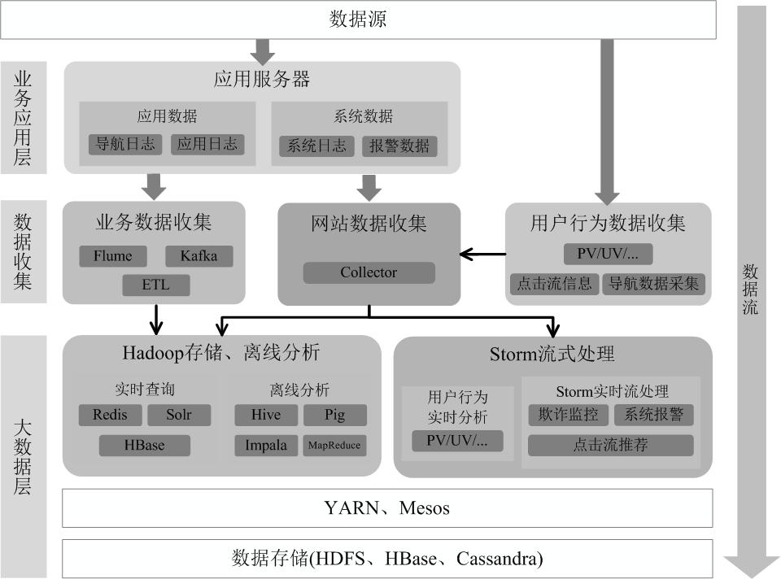

但是，上述的这种架构部署较为繁琐。由于Spark同时支持批处理与流处理，因此，对于某些类型的企业应用而言，从“Hadoop+Storm”架构转向Spark架构就成为一种很自然的选择。采用Spark架构具有如下优点：
- 实现一键式安装和配置、线程级别的任务监控和告警
- 降低硬件集群、软件维护、任务监控和应用开发的难度
- 便于做成统一的硬件、计算平台资源池

## DStream操作概述
### Spark Streaming工作机制
在Spark Streaming中，会有一个组件Receiver，作为一个长期运行的任务(Task)运行在一个Executor上，每个Receiver都会负责一个DStream输入流（如从文件中读取数据的文件流、套接字流或者Kafka中读取的一个输入流等）。Receiver组件接收到数据源发来的数据后，会提交给Spark Streaming程序进行处理。处理后的结果，可以交给可视化组件进行可视化展示，也可以写入到HDFS、HBase中。

### 编写Spark Streaming程序的基本步骤
编写Spark Streaming程序的基本步骤如下：
- 通过创建输入DStream(Input DStream)来定义输入源。流计算处理的数据对象是来自输入源的数据，这些输入源会源源不断产生数据，并发送给Spark Streaming，由Receiver组件接收到以后，交给用户自定义的Spark Streaming程序进行处理
- 通过对DStream应用转换操作和输出操作来定义流计算。流计算过程通常是由用户自定义实现的，需要调用各种DStream操作实现用户处理逻辑
- 调用StreamingContext对象的start()方法来开始接收数据和处理流程
- 通过调用StreamingContext对象的awaitTermination()方法来等待流计算进程结束，或者可以通过调用StreamingContext对象的stop()方法来手动结束流计算进程

### 创建StreamingContext对象
在RDD编程中需要生成一个SparkContext对象，在Spark SQL中需要生成一个SparkSession对象，同理，如果要运行一个Spark Streaming程序，就需要首先生成一个StreamingContext对象，它是Spark Streaming程序的主入口

可以从一个SparkConf对象创建一个Streaming Context对象。启动spark-shell,就已经获得一个默认的SparkContext对象，也就是sc。因此，可以采用如下方式创建StreamingContext对象：  
```scala
scala> import  org.apache.spark.streaming._

scala> val ssc = new StreamingContext(sc, Seconds(1))
```
`new StreamingContext(sc, Seconds(1))`的两个参数中，`sc`表示SparkContext对象，Seconds(1)表示在对Spark Streaming的数据流进行分段时，每1秒切成一个分段。可以调整分段大小，比如使用Seconds(5)就表示每5秒切成一个分段，但是，无法实现毫秒级别的分段，因此，Spark Streaming无法实现毫秒级别的流计算。

如果是编写一个独立的Spark Streaming程序，而不是在spark-shell中运行，则需要在代码文件中通过如下方式创建StreamingContext对象：  
```scala
import org.apache.spark._
import org.apache.spark.streaming._
val conf = new SparkConf().setAppName("TestDStream").setMaster("local[2]")
val ssc = new StreamingContext(conf, Seconds(1))
```

## 基本输入源
Spark Streaming可以来自对不同类型数据源的数据进行处理，包括基本数据源和高级数据源（如Kafka、Flume等）。

### 文件流
在文件流的应用场景中，需要编写Spark Streaming程序，一直对文件系统中的某个目录进行监听，一旦发现有新的文件生成，Spark Streaming就会自动生成把文件内容读取过来，使用用户自定义的处理逻辑进行处理。

**1.在spark-shell中创建文件流**  
首先，在Linux系统打开一个终端（数据源终端），然后创建一个logfile  
```shell
$ cd /opt/software/spark/mycode
$ mkdir streaming & cd streaming
$ mkdir logfile
```

然后，打开第二个终端（流计算终端）,进入spark-shell，然后输入以下语句
```scala
scala> import org.apache.spark.streaming._
scala> val ssc = new StreamingContext(sc, Seconds(20))
scala> val lines = ssc.textFileStream("file:///opt/software/spark/mycode/streaming/logfile")
scala> val words = lines.flatMap(_.split(" "))
scala> val wordCounts = words.map(x => (x, 1)).reduceByKey(_+_)
scala> wordCounts.print()
scala> ssc.start()
scala> ssc.awaitTermination()
```

在spark-shell中输入`ssc.start()`以后，程序就开始自动进入循环监听状态，屏幕上会不断显示信息

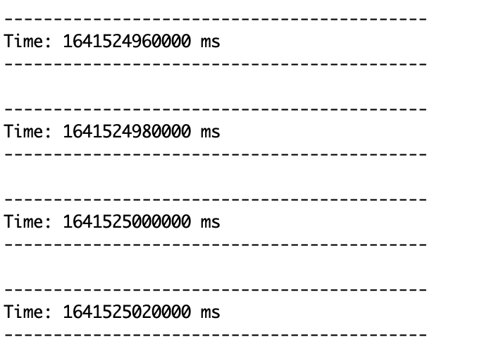

这里可以切换到数据源终端，`logfile`文件夹中创建一个log.txt文件，在文件中输入一些英文语句后保存并退出文件编辑器。然后切换到流计算终端，等待20秒左右，会出现词频统计结果

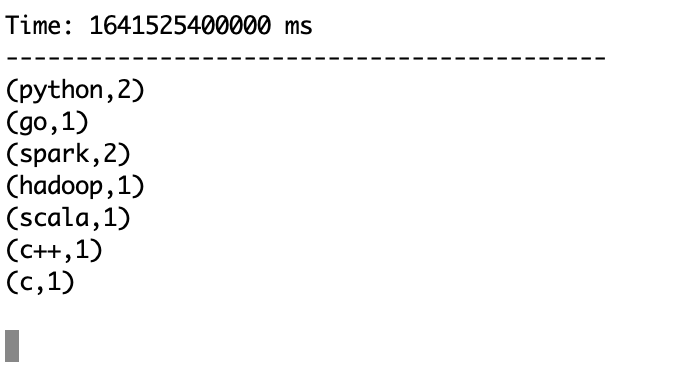

**2.采用独立应用程序方式创建文件流**  
首先，创建代码目录和代码文件TestStreaming，关闭之前打开的所有终端，重新打开一个终端（流计算终端）

在IDEA中创建一个Scala Object，输入以下代码
```scala
import org.apache.spark._
import org.apache.spark.streaming._

object TestStreaming {
  def main(args: Array[String]): Unit = {
    val sparkConf = new SparkConf().setAppName("WordCountStreaming").setMaster("local[2]")
    val ssc = new StreamingContext(sparkConf, Seconds(10))
    val lines = ssc.textFileStream("file:///opt/spark/mycode/logfile")
    val words = lines.flatMap(_.split(" "))
    val wordCounts = words.map(x => (x,1)).reduceByKey(_+_)
    wordCounts.print()
    ssc.start()
    ssc.awaitTermination()
  }
}
```
Maven pom.xml可以参考  
```xml
<?xml version="1.0" encoding="UTF-8"?>
<project>
    <modelVersion>4.0.0</modelVersion>

    <groupId>zyc</groupId>
    <artifactId>MavenProject</artifactId>
    <version>1.0</version>

    <dependencies>
        <dependency>
            <groupId>org.apache.spark</groupId>
            <artifactId>spark-core_2.11</artifactId>
            <version>2.0.0</version>
        </dependency>
        <dependency>
            <groupId>org.apache.spark</groupId>
            <artifactId>spark-sql_2.11</artifactId>
            <version>2.0.0</version>
        </dependency>
        <dependency>
            <groupId>org.apache.spark</groupId>
            <artifactId>spark-streaming_2.11</artifactId>
            <version>2.0.0</version>
        </dependency>
        <dependency>
            <groupId>org.apache.spark</groupId>
            <artifactId>spark-mllib_2.11</artifactId>
            <version>2.0.0</version>
        </dependency>
        <dependency>
            <groupId>org.apache.spark</groupId>
            <artifactId>spark-hive_2.11</artifactId>
            <version>2.0.0</version>
        </dependency>
    </dependencies>
</project>
```

然后打包编译上传至Linux，使用`spark-submit`提交运行程序,出现下面情形代表启动成功

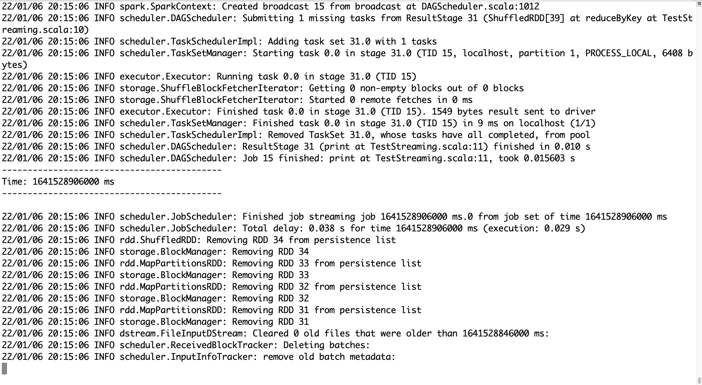

然后在logfile文件夹下创建一个log2.txt文件，输入一些单词，保存退出切换至程序运行的终端，等待2秒就会出现单词计数。如下图

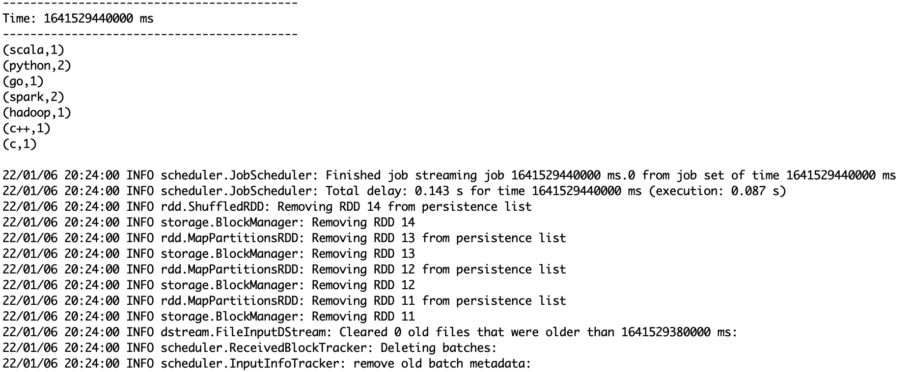


### 套接字流   
Spark Streaming可以通过Socket端口监听并接收数据，然后进行相应处理。  
**1.Socket工作原理**  
在网络编程中，大量的数据交换是通过Socket实现的。Socket工作原理如下,服务器先初始化Socket，然后与端口绑定(Bind)，对端口进行监听(Listen)，调用accept()方法进入阻塞状态，等待客户端连接。客户端初始化一个Socket，然后连接服务器(Connect)，如果连接成功，这时客户端与服务器端的连接就建立了。客户端发送数据请求，服务器端接收请求并处理请求，然后把回应数据发送给客户端，客户端读取数据，最后关闭连接，一次交互结束  

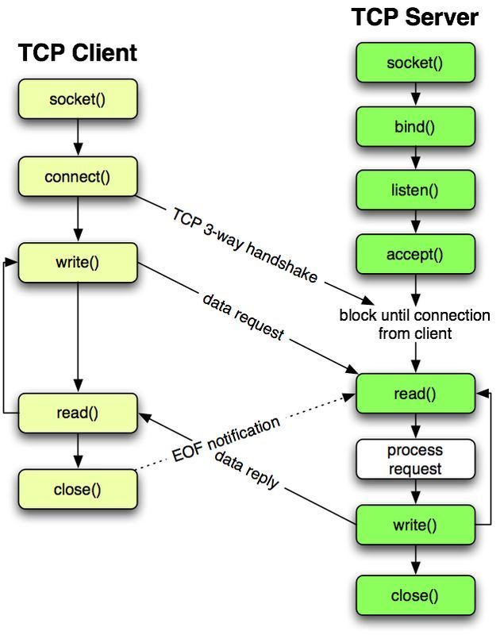

**2.使用套接字流作为数据源**  
在套接字流作为数据源的应用场景中，Spark Streaming程序就是上图所示的Socket通信的客户端，它通过Socket方式请求数据，获取数据以后启动流计算过程进行处理。  
下面编写一个Spark Streaming独立应用程序来实现这个应用场景。

首先，在IDEA创建一个Scala工程，选择sbt为打包方式，写入以下内容
```scala
import org.apache.spark._
import org.apache.spark.streaming._
import org.apache.spark.storage.StorageLevel


object NetworkWordCount {
  def main(args: Array[String]): Unit = {
    if (args.length < 2){
      System.err.println("Usage: NetworkWordCount <hostname> <port>")
      System.exit(1)
    }
    val sparkConf = new SparkConf().setAppName("NetworkWordCount").setMaster("local[2]")
    val ssc = new StreamingContext(sparkConf, Seconds(10))
    val lines = ssc.socketTextStream(args(0), args(1).toInt, StorageLevel.MEMORY_AND_DISK_SER)
    val words = lines.flatMap(_.split(" "))
    val wordCounts = words.map(x => (x, 1)).reduceByKey(_+_)
    wordCounts.print()
    ssc.start()
    ssc.awaitTermination()
  }
}
```

然后在相同目录下，新建一个Scala文件StreamingExamples.scala，输入以下代码  
```scala
package org.apache.spark.examples.streaming

import org.apache.spark.internal.Logging
import org.apache.log4j.{Level, Logger}


/** Utility functions for Spark Streaming examples. */
object StreamingExamples extends Logging {
  /** Set reasonable logging levels for streaming if the user has not configured log4j. */
  def setStreamingLogLevels() {
    val log4jInitialized = Logger.getRootLogger.getAllAppenders.hasMoreElements
    if(!log4jInitialized){
      //We first log something to initialize Spark's default loggin, then we override the logging level
      logInfo("Setting log level to [WARN] for steaming exmaple."+" To override add a custom log4j.properties to the classpath.")
      Logger.getRootLogger.setLevel(Level.WARN)
    }
  }
}
```

sbt文件内容为
```sbt
name := "socket"

version := "1.0"

scalaVersion := "2.11.8"

libraryDependencies += "org.apache.spark" % "spark-streaming_2.11" % "2.0.0"
```

然后打包编译，上传至Linux，到带有jar包的目录提交jar包，命令如下：  
`
spark-submit --class "org.apache.spark.examples.streaming.NetworkWordCount" socket.jar localhost 9999

`

执行上面的命令后，就在当前的Linux终端（即“流计算终端”）内顺利启动了Socket客户端，现在，再打开一个终端（数据源终端），启动一个Socket服务器端，让该服务器端接收客户端的请求，并给客户端不断发送数据流。通常，Linux发行版中都带有NetCat（nc），可以使用nc命令生成一个Socket服务器端：  
`$ nc -lk 9999`

在上面的命令中，-l这个参数表示启动监听模式，也就是作为Socket服务器端，nc会监听本机(localhost)的9999端口，只要监听到来自客户端的连接请求，就会与客户端建立连接通道，把数据发送给客户端；-k表示多次监听，而不是监听一次

由于之前在流计算终端内运行了NetworkWordCount程序，该程序扮演了Socket客户端的角色，会向localhost的9999端口发送链接请求，所以，数据源终端内的nc进程就会监听9999端口有来自客户端的连接请求，于是就会建立服务器端和客户端之间的连接通道。连接通道建立以后，nc成宿就会把我们在数据源终端内手动输入的内容，全部发送给“流计算终端”内的NetworkWordCount程序进行处理。为了测试程序运行的效果，在“数据源终端”内执行上面的nc命令后，可以通过键盘输入一行英文句子不断发送给“流计算终端”的NetworkWordCount程序。在“流计算终端”打印出词频统计信息，结果如下

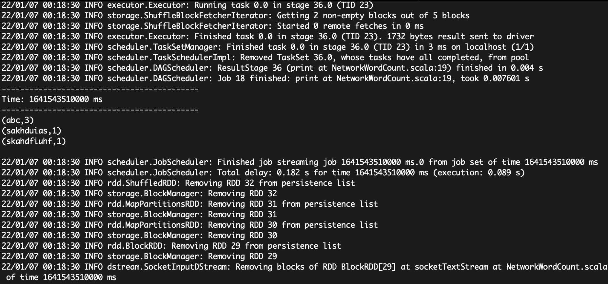

**3.使用Socket编程实现自定义数据源**  
在之前的实例中，采用了nc程序作为数据源。现在把数据源的产生方式修改了一下，不使用nc程序，而是采用自己编写的程序产生Socket数据源。
关闭Linux系统中已经打开的终端
在IDEA创建一个sbt，创建一个Scala文件DataSourceSocket.scala，输入如下代码：  
```scala
package org.apache.spark.examples.streaming
import org.scalatest.enablers.Length

import java.io.{PrintStream, PrintWriter}
import java.net.ServerSocket
import scala.io.Source

object DataSourceSocket {
  def index(length: Int) = {
    val rdm = new java.util.Random()
    rdm.nextInt(length)
  }

  def main(args: Array[String]): Unit = {
    if (args.length != 3) {
      System.err.println("Usage: <filename> <port> <millisecond>")
      System.exit(1)
    }

    val fileName = args(0)
    val lines = Source.fromFile(fileName).getLines.toList
    val rowCount = lines.length
    val listener = new ServerSocket(args(1).toInt)
    while (true) {
      val socket = listener.accept()
      new Thread() {
        override def run = {
          println("Got client connected from: " + socket.getInetAddress)
          val out = new PrintWriter(socket.getOutputStream(), true)
          while (true) {
            Thread.sleep(args(2).toLong)
            val content = lines(index(rowCount))
            println(content)
            out.write(content + '\n')
            out.flush()
          }
          socket.close()
        }
      }.start()
    }
  }
}

```

上面代码的功能是，从一个文件中读取内容，把文件的每一行作为一个字符串，每次随机选择文件中的一行，源源不断发送给客户端。DataSourceSocket程序在运行时，需要为该程序提供3个参数，即<filename>、<port>、<millisecond>，其中，<filename>表示作为数据源头的文件的路径，<port>表示Socket通信的端口号、<millisecond>表示Socket服务器端（即DataSourceSocket程序）每隔多长时间向客户端发送一次数据。

`val lines = Source.fromFile(fileName).getLines.toList`语句执行后，文件中的所有行的内容都会被读取到列表lines中。`val listener = new ServerSocket(args(1).toInt)`语句用于在服务器端创建监听特定端口的ServerSocket对象，ServerSocket负责接收客户端的连接请求。`val socket = listener.accept()`语句执行后，`listener`会进入阻塞状态，一直等待客户端的连接请求。一旦listener监听到特定端口上有来自客户端的请求，就会执行new Thread()，生成新的线程，负责和客户端建立连接，并发送数据给客户端。

接下来，我们打包编译，上传至Linux，然后提交jar包  
`spark-submit --class "org.apache.spark.examples.streaming.DataSourceSocket" socket.jar /opt/spark/mycode/streaming/logfile/log.txt 9999 1000`

运行结果如下图

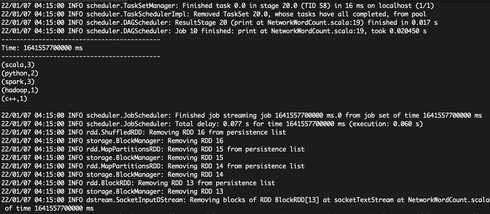


### RDD队列流
在编写Spark Streaming应用程序的时候，可以调用StreamingContext对象的queueStreaming()方法来创建基于RDD队列的DStream。例如，`streamingContext.queueStream(queueOfRDD)`，其中，`queueOfRDD`是一个RDD队列。  
这里给出一个RDD队列流的实例，在该实例中，每隔1秒创建一个RDD放入队列，Spark Streaming每隔两秒就从队列中取出数据进行处理。

在IDEA中，新建一个Scala工程`rddqueue`，然后创建文件`TestRDDQueueStream.scala`，输入以下代码：

```scala
package org.apache.spark.examples.streaming

import org.apache.spark.SparkConf
import org.apache.spark.rdd.RDD
import org.apache.spark.streaming.StreamingContext._
import org.apache.spark.streaming.{Seconds, StreamingContext}

object QueueStream {
  def main(args: Array[String]){
    val conf = new SparkConf().setAppName("TestRDDQueue").setMaster("local[2]")
    val ssc = new StreamingContext(conf, Seconds(2))
    val rddQueue = new scala.collection.mutable.SynchronizedQueue[RDD[Int]]()
    val queueStream = ssc.queueStream(rddQueue)
    val mappedStream = queueStream.map(r => (r % 10, 1))
    val reduceStream = mappedStream.reduceByKey(_+_)
    reduceStream.print()
    ssc.start()
    for (i <- 1 to 10){
      rddQueue += ssc.sparkContext.makeRDD(1 to 100, 2)
      Thread.sleep(1000)
    }
    ssc.stop()
  }
}
```

之后打包上传至Linux服务器，提交jar就可以看到运行结果


## 高级数据源

